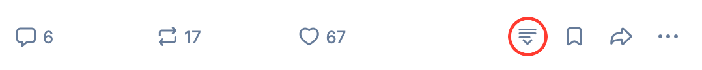

# bsky-unroller

A userscript that adds an **Unroll thread** link to every post on
[bsky.app](https://bsky.app), placed just to the left of the **Save** (bookmark)
button. It points at the same post on [tbsky.app](https://tbsky.app) — a
threaded/unrolled reader. Because it's a real link, it behaves like any other:
**left-click** navigates in the current tab, while **middle-click** or
**Cmd/Ctrl-click** opens it in a new tab.

## Install

**[Click here to install](https://raw.githubusercontent.com/hughescr/userscripts/main/bsky-unroller/bsky-unroller.user.js)**

(Requires a userscript manager — Tampermonkey or the Userscripts Safari
extension. See the [repo README](../README.md#installing-a-userscript) for setup
and auto-update details.)

## How it works

bsky.app is a React single-page app, so posts render and re-render dynamically.
The script:

- Watches the page with a **`MutationObserver`** and scans for action bars as
  they appear (including after client-side navigation and re-renders).
- Locates each post's bookmark button via its stable
  **`data-testid="postBookmarkBtn"`** attribute and inserts the Unroll button
  immediately before it, so it joins the right-hand action group and inherits the
  native spacing.
- Reads the bookmark icon's current color at insertion time so the Unroll icon
  automatically matches the active theme (light / dim / dark).
- Derives the canonical `/profile/<handle>/post/<rkey>` path for each post and
  rewrites the host to `tbsky.app`.

Because React can occasionally re-render an action bar and drop the injected
button, the script is idempotent and **self-heals**: the observer re-adds the
button whenever it goes missing, and insertions are guarded so it's never added
twice.

## Known caveats

- **bsky DOM coupling.** The script keys off bsky's `data-testid` attributes
  (e.g. `postBookmarkBtn`). These are reasonably stable, but Bluesky may change
  its DOM in a future build, which could break button placement or URL
  extraction until the script is updated. It deliberately does **not** rely on
  bsky's atomic CSS class names (`css-*` / `r-*`), which are not stable.
- **Safari userscript managers.** Tested under Tampermonkey and the Userscripts
  Safari extension. Behavior is the same, but the two managers have slightly
  different install/permission UIs — make sure the script is enabled for
  `bsky.app`.
